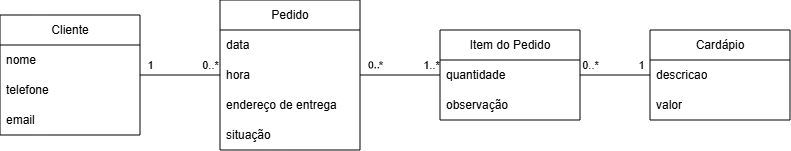

# Problema

A **SandubaJá** é um delivery de lanches que atualmente registra suas atividades em um caderno, o que tem causado problemas operacionais — como pedidos duplicados, trocados ou perdidos. Para resolver esses problemas, é necessário desenvolver um sistema de controle de pedidos.

O software será um Sistema de Controle de Pedidos para organizar e agilizar o processo de registro, produção e entrega de pedidos. O usuário do sistema deve ser capaz de cadastrar clientes, registrar pedidos, acompanhar a produção e controlar as entregas.

Os pedidos são feitos por telefone ou por WhatsApp. O cliente informa os itens do cardápio e a forma de pagamento. Após o registro, o pedido entra em produção; quando estiver pronto, sai para entrega com um motoboy. Ao retornar, o motoboy entrega o pagamento, finalizando o pedido.

Já foram definidos o modelo conceitual e as user stories que guiarão o desenvolvimento. Além disso, é necessário cumprir os testes unitários disponibilizados, adotando o fluxo de desenvolvimento orientado a testes (TDD). Desenvolva o código necessário para que os testes passem.

## Modelo Conceitual

## User Stories

| ID | Descrição |
|---:|---|
| 1 | Cadastrar cliente: adicionar um novo cliente ao sistema; os clientes mais recentes devem ser armazenados ao final da lista. |
| 2 | Remover cliente: ao informar o telefone, remover todos os clientes com esse telefone do sistema. |
| 3 | Consultar cliente: buscar clientes por nome (parcial) ou por telefone (exato) e listar os resultados na ordem em que foram cadastrados. |
| 4 | Criar novo pedido: criar um novo pedido e inseri-lo ao final da lista de pedidos. |
| 5 | Inserir itens ao pedido: após o registro inicial do pedido, inserir itens do cardápio conforme solicitação do cliente e apresentar o valor total do pedido. |
| 6 | Atualizar situação do pedido: avançar o primeiro pedido em aberto no fluxo de estados até a conclusão. |
| 7 | Listar pedidos em aberto: exibir todos os pedidos em aberto na ordem de criação, mostrando também o status atual de cada um. |
| 8 | Adicionar opções ao cardápio: incluir uma nova opção no cardápio do sistema. |
| 9 | Apresentar as opções do cardápio: exibir as opções disponíveis no cardápio do sistema. |
| 10 | Cancelar pedido: permitir cancelar um pedido aberto informando um motivo, removendo-o da fila de abertos e registrando o motivo. |
| 11 | Definir forma de pagamento: permitir definir a forma de pagamento (dinheiro, pix, cartao) de um pedido aberto. |

Observação: não é necessária interface gráfica e nem mesmo persistência das informações em um banco de dados; basta que os testes unitários sejam atendidos. Durante o desenvolvimento você deve estar sempre aplicando os conceitos aprendidos sobre Clean Code.

## Como executar os testes e linters

Requisitos: Python 3.13, ambiente virtual (pyproject já configurado para venv `.venv`).

- Rodar testes (na pasta `Problema/`):
  - `python -m pytest -q`

- Formatar com Black:
  - `python -m black .`

- Lintar e auto-fixar com Ruff:
  - `python -m ruff check .`
  - `python -m ruff format .`

Dica: os limites de linha são controlados pelo Black; o Ruff ignora E501 neste projeto para evitar conflitos com comentários/docstrings longos.

## Contato

Em caso de dúvidas, entre em contato:
- E-mail: [jprcarvalho1@gmail.com](mailto:jprcarvalho1@gmail.com)
- Telefone/WhatsApp: [(75) 99237-0004](tel:+5575992370004)
